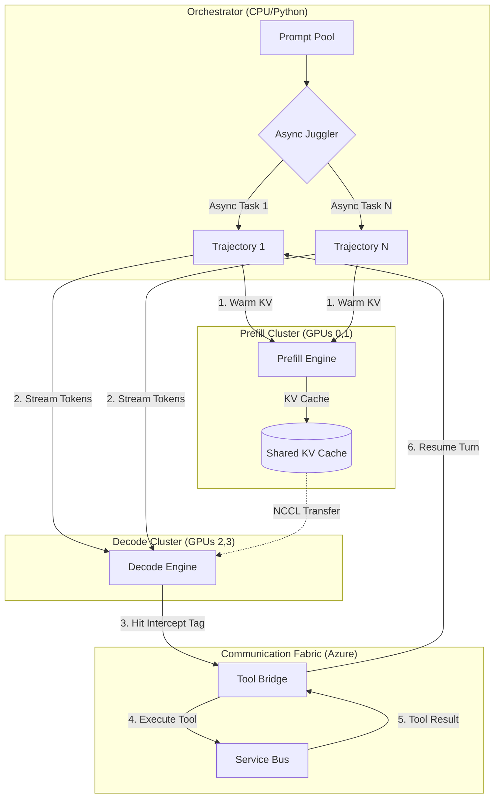

# DisGenerator: Distributed Trajectory Generator

## Overview

DisGenerator is a high-throughput trajectory generation service for training data collection. It generates multiple completions per prompt with tool calling support, designed to feed the DisTrainer with JSONL training data.

**Inspiration**: Prime Intellect's INTELLECT-3 training pipeline, which uses disaggregated prefill/decode serving for efficient RL data collection.

---

## Architecture Decision: Disaggregated Serving (2P/2D)

### Why Disagg Serving?

We are using **Disaggregated Prefill-Decode Serving** with:
- **2 Prefill GPUs** (GPUs 0, 1): Specialize in processing prompts and conversation history.
- **2 Decode GPUs** (GPUs 2, 3): Specialize in token-by-token generation.

### When Disagg Serving Shines

The key to making this architecture efficient is **high concurrency**:

| Concurrency | GPU Utilization |
| :--- | :--- |
| 1 prompt at a time | Low (Prefill GPUs idle 99% of time) |
| 10+ prompts at a time | High (Pipeline stays saturated) |

**Our Strategy**: Process 10+ prompts simultaneously (80+ trajectories = 10 prompts × 8 completions).

**The Pipeline Visualized**:



### The "Juggler" Analogy
The `DisGenerator` acts as a high-speed **Juggler**. Each completion is a ball:
1.  **Throw (Prefill)**: The juggler tosses a prompt into the prefill hand.
2.  **Catch & Spin (Decode)**: The decode hand generates tokens as long as the ball is in flight.
3.  **Bounce (Tool Call)**: If a tool tag is hit, the ball "bounces" off the table (Azure Service Bus).
4.  **No Stalling**: While waiting for a ball to bounce back from the table, the juggler doesn't stop; they continue throwing and catching the other 79 balls.

---

---

## Configuration

### Prompt Parameters
- **Prompts per batch**: 10 (configurable)
- **Completions per prompt**: 8
- **Max tokens per completion**: 4096 (long trajectories)
- **Max turns (tool calls)**: 8

### GPU Configuration
- **Total GPUs**: 4
- **Prefill Cluster**: GPUs 0, 1 (TP=2)
- **Decode Cluster**: GPUs 2, 3 (TP=2)
- **Model**: Qwen/Qwen3-4B (or Qwen2.5-4B-Instruct)

---

## Server Launch Commands

### Prefill Server (GPUs 0, 1)
```bash
export CUDA_VISIBLE_DEVICES=0,1

python -m vllm.entrypoints.openai.api_server \
    --model Qwen/Qwen3-4B \
    --tensor-parallel-size 2 \
    --port 8100 \
    --max-model-len 32768 \
    --gpu-memory-utilization 0.85 \
    --enable-prefix-caching \
    --max-num-seqs 128
```

### Decode Server (GPUs 2, 3)
```bash
export CUDA_VISIBLE_DEVICES=2,3

python -m vllm.entrypoints.openai.api_server \
    --model Qwen/Qwen3-4B \
    --tensor-parallel-size 2 \
    --port 8200 \
    --max-model-len 32768 \
    --gpu-memory-utilization 0.85 \
    --enable-prefix-caching \
    --max-num-seqs 128
```

---

## Tool Calling Interception

### The Flow for One Completion

1. **Prefill Phase**: Send request to Prefill server with `max_tokens=1` to warm up KV cache.
2. **Decode Phase**: Send request to Decode server with `stop=["<tool_call>", "<solution>"]`.
3. **Stream & Parse**: Read tokens, detect tool call patterns.
4. **Execute Tool**: Call Service Bus (Web/Code/Azure) via existing `communication/` modules.
5. **Resume**: Append tool result to history, repeat from Step 1.

### Code Pattern
```python
async def generate_trajectory_disagg(prompt, completion_id):
    messages = [{"role": "user", "content": prompt}]
    full_text = prompt
    
    for turn in range(8):
        # Step 1: Prefill (warm up KV cache)
        await session.post(f"{PREFILL_URL}/v1/chat/completions", json={
            "messages": messages,
            "max_tokens": 1
        })
        
        # Step 2: Decode (stream tokens until stop)
        async with session.post(f"{DECODE_URL}/v1/chat/completions", json={
            "messages": messages,
            "stream": True,
            "stop": ["<tool_call>", "<solution>"],
            "logprobs": True
        }) as response:
            buffer = ""
            async for chunk in response.content.iter_any():
                buffer += parse_sse(chunk)
        
        full_text += buffer
        
        if "<solution>" in buffer:
            break
        
        if "<tool_call>" in buffer:
            result = await execute_tool(extract_payload(buffer))
            buffer += f"<tool_result>{result}</tool_result>"
            full_text += f"<tool_result>{result}</tool_result>"
        
        messages.append({"role": "assistant", "content": buffer})
    
    return full_text
```

---

## Communication Fabric (Existing)

Reuse modules from `serving/communication/`:
- `command_sender.py` → Web tool
- `code_command_sender.py` → Code execution
- `azure_command_sender.py` → Azure tool
- `grader_command_sender.py` → Reward scoring (to be moved here or imported)

All use Azure Service Bus for async request/response.

---

## Output Format (JSONL for DisTrainer)

Each line in the output file:
```json
{
  "prompt": "User query text",
  "prompt_ids": [1, 2, 3, ...],
  "completions": [
    {
      "text": "Full trajectory with <tool_call>...<tool_result>...",
      "completion_ids": [101, 55, 78, ...],
      "old_logprobs": [-0.5, -0.2, -0.8, ...],
      "reward": 4.5
    }
    // ... 7 more completions
  ],
  "metadata": {"timestamp": "2024-12-22T..."}
}
```

---

## Questions & Concerns

### Q1: Why not TP=4 Unified?
- **Answer**: For 1 prompt at a time, TP=4 is simpler. But with 10+ prompts concurrent, disagg allows pipelining (prefill new prompts while decoding old ones).

### Q2: How does prefix caching work across Prefill/Decode?
- **Answer**: Currently, standard vLLM disagg doesn't share cache between instances. The Prefill server warms the cache, but the Decode server must recompute or receive via KV transfer. We use `enable-prefix-caching` on both to maximize local reuse.

### Q3: What if a completion has many tool calls?
- **Answer**: Each tool call triggers a new Prefill+Decode cycle. The conversation history grows, but prefix caching ensures we don't recompute the entire history.

### Q4: How do we get logprobs for PPO/GRPO?
- **Answer**: Pass `logprobs=True` in the decode request. vLLM returns per-token log probabilities.

### Q5: What about straggler completions?
- **Answer**: If one completion takes longer (many tool calls), others finish first. The async orchestrator handles this naturally.

---

## Implementation Plan

### Phase 1: Infrastructure ✅ COMPLETE
- [x] Create `serving/DisGenerator/` folder structure
- [x] Create launch scripts for Prefill and Decode servers (`scripts/`)
- [x] Create `config.py` with all configuration options
- [x] Create `.env.template` for environment setup

### Phase 2: Orchestrator ✅ COMPLETE
- [x] Implement async orchestrator (`generator.py`)
- [x] Implement tool interception logic (SSEParser, ToolParser)
- [x] Integrate with existing `communication/` modules (`tool_executor.py`)

### Phase 3: Reward & Output ✅ COMPLETE
- [x] Integrate grader (reward model) calls via `AsyncToolExecutor.grade_completion()`
- [x] Implement JSONL writer matching DisTrainer format
- [x] Add logprob extraction from streaming responses

### Phase 4: Testing 🔄 IN PROGRESS
- [ ] Test with mock tools (fast iteration)
- [ ] Test with real Service Bus connection
- [ ] Validate output format against DisTrainer expectations

---

## Running the Servers

### Quick Start (All Servers)

```bash
cd serving/DisGenerator

# Start both Prefill and Decode servers
bash scripts/start_all.sh

# Monitor logs
tail -f logs/prefill.log logs/decode.log

# Stop all servers when done
bash scripts/stop_all.sh
```

### Manual Server Start

If you prefer to start servers individually (useful for debugging):

**Terminal 1 - Prefill Server (GPUs 0,1):**
```bash
cd serving/DisGenerator
bash scripts/start_prefill.sh
```

**Terminal 2 - Decode Server (GPUs 2,3):**
```bash
cd serving/DisGenerator
bash scripts/start_decode.sh
```

### Health Check

```bash
# Check if servers are running
curl http://localhost:8100/health  # Prefill
curl http://localhost:8200/health  # Decode

# List available models
curl http://localhost:8100/v1/models
curl http://localhost:8200/v1/models
```

---

## Testing the Generator

### Using the Test Prompts File

A sample `prompts.jsonl` file is included for testing. Use `uv run` to execute:

```bash
cd serving/DisGenerator

# Run with test prompts
uv run python run.py --prompts-file prompts.jsonl --output-dir ./data/test_output

# Run with debug logging
uv run python run.py --prompts-file prompts.jsonl --debug
```

### Interactive Mode

```bash
uv run python run.py --interactive
```

Then enter prompts one per line and type `generate` to process them.

### Custom Batch Size

```bash
# Process 5 prompts at a time
uv run python run.py --prompts-file prompts.jsonl --batch-size 5
```

---

## File Structure (Implemented)

```
serving/DisGenerator/
├── DisGenerator.MD          # This document
├── __init__.py              # Package exports
├── config.py                # Configuration (ports, model, timeouts, etc.)
├── generator.py             # Main async orchestrator with SSE/tool parsing
├── tool_executor.py         # Async tool execution via Service Bus
├── run.py                   # CLI runner (batch & interactive modes)
├── prompts.jsonl            # Sample test prompts for testing
├── requirements.txt         # Python dependencies
├── .env.template            # Environment variable template
├── scripts/
│   ├── start_prefill.sh     # Launch prefill server (GPUs 0,1)
│   ├── start_decode.sh      # Launch decode server (GPUs 2,3)
│   ├── start_all.sh         # Launch everything with health checks
│   └── stop_all.sh          # Graceful shutdown
├── logs/                    # Server logs (created at runtime)
└── data/                    # Generated output (created at runtime)
    └── generations/         # JSONL output files
```

---

## References

- **Prime Intellect INTELLECT-3**: https://www.primeintellect.ai/blog/intellect-3
- **Prime Intellect prime-rl repo**: https://github.com/PrimeIntellect-ai/prime-rl
- **vLLM Disaggregated Serving**: https://docs.vllm.ai/en/latest/serving/disagg_prefill.html
- **Existing DisTrainer**: `serving/DisTrainer/`
- **Existing ToolGRPOTrainer**: `serving/ToolGRPOTrainer/`
