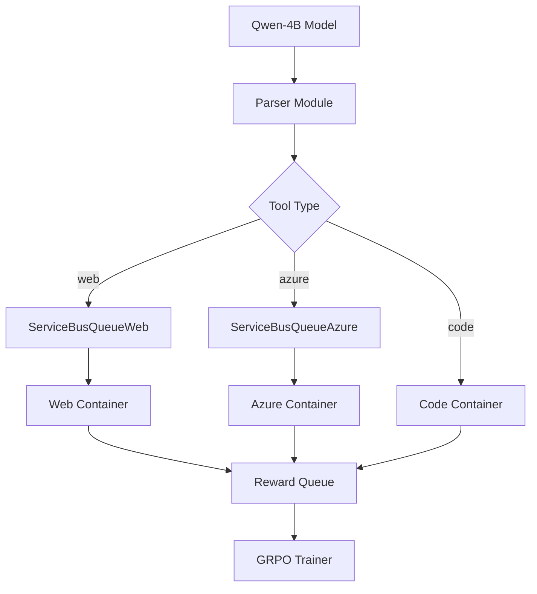
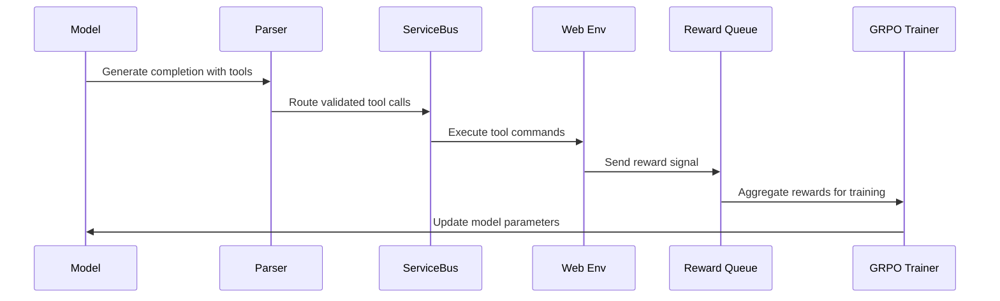

# GRPO Training Implementation 

Now as we have the basic infrastructure setup we will be implementing the following  - 

We will have the following mechanism 

1) For rewarding the model to have a correct tool call - If the model selects the correct tool we will have to reward the model (for now let's not implement it as this will be have to done on this machine itself using LLM as a judge)

2) Once the llm selects a tool like in this case the web tool, it will execute the command using the web tool. If it correctly executes the web env, (along with the format etc) it will get a reward from this web env too. 

3) This reward will be accumulated in a reward queue on this machine itself. Once we have the rewards for the entire task like 

reward_queue = [(web_env, 3), (code_env, 2), (infra/azure_env, 2)] then we will use another LLM as a judge for final env called task_env which will test whether the model has successfully completed the task and will assign a reward so the final reward queue will be [(web_env, 3), (code_env, 2), (infra/azure_env, 2), (task_reward, 2)] 

Remember the task queue will get the entire trajectory of the task and also will have the ability to generate novel test cases by itself. And then for now we will just add up these rewards, normalize them and send them back to the grpo algorithm 

4) Also for fun, for testing we will run one of the env from the enviornment hub on Prime Intellect to make the model perform better

## For now, we will just stick with the web tool/ env

Here’s the **reference for GRPO Trainer** with vLLM support from Hugging Face:

* **GRPO Trainer Documentation**: [https://huggingface.co/docs/trl/main/en/grpo\_trainer](https://huggingface.co/docs/trl/main/en/grpo_trainer)

### Minimal Example with vLLM (Single GPU)

```python
from datasets import load_dataset
from trl import GRPOConfig, GRPOTrainer

# Load dataset
dataset = load_dataset("trl-lib/tldr", split="train")

# Basic GRPO config with vLLM colocation
training_args = GRPOConfig(
    output_dir="grpo-vllm-demo",
    use_vllm=True,
    vllm_mode="colocate",            # run vLLM in the same process
    vllm_gpu_memory_utilization=0.3, # control GPU memory usage
    max_steps=100,
    num_generations=2,
    per_device_train_batch_size=2,
    logging_steps=5,
)

# Simple reward function placeholder (not used for now)
def reward_fn(completions, **kwargs):
    return [0 for _ in completions]

# Initialize trainer
trainer = GRPOTrainer(
    model="Qwen/Qwen2-0.5B-Instruct",  # example model
    train_dataset=dataset,
    reward_funcs=reward_fn,            # dummy reward function
    args=training_args,
)

# Train
trainer.train()
```

### Install dependencies:

```bash
pip install "trl[vllm]" datasets accelerate
```

This keeps things **very simple**: one A100 GPU, vLLM co-location, minimal dataset, and no complex reward logic yet.

---

If you want, I can give you a **list of all key GRPOConfig arguments** you’ll likely need for real experiments with vLLM. Would you like me to prepare that?

---

# GRPO Training Feature Documentation (Comprehensive Analysis)

## Changelog
- **2024-09-05-001**: Comprehensive documentation of current GRPO training implementation with reward mechanisms and tool orchestration.

---

## A) Problem & Scope

**Users**: ML researchers training reasoning-focused LLMs to use external tools for complex task completion.

**Problem**: Training a Qwen-4B model with LoRA adapters to effectively orchestrate multiple containerized tools (web search, code execution, Azure CLI) using Group Relative Preference Optimization (GRPO) with reward signals from tool execution environments.

**Constraints**: 
- Single A100 GPU training environment (lines 35-41 above)
- Containerized tool execution with Azure Service Bus communication (`/home/ubuntu/GeneratorFS/serving/servicebus_web.py:1-20`, `/home/ubuntu/GeneratorFS/serving/servicebus_azure.py:1-15`)
- Real-time reward collection from multiple environments

**Non-goals**: Multi-GPU distributed training, non-containerized tool execution, other RL algorithms beyond GRPO.

---

## B) Requirements

**FR-001**: GRPO Training Pipeline
- **Acceptance Criteria**: Train Qwen-4B model using TRL GRPOTrainer with vLLM backend
- **Code Evidence**: Lines 35-58 above, `/home/ubuntu/GeneratorFS/serving/features/grpo_training.md`

**FR-002**: Multi-Tool Reward Collection
- **Acceptance Criteria**: Collect rewards from web, code, and azure environments via Service Bus queues
- **Code Evidence**: `/home/ubuntu/GeneratorFS/serving/servicebus_web.py:39-75`, `/home/ubuntu/GeneratorFS/serving/servicebus_azure.py:39-75`

**FR-003**: Tool Call Parsing and Validation
- **Acceptance Criteria**: Parse `<web>`, `<code>`, `<azure>` XML tags and validate JSON schemas
- **Code Evidence**: `/home/ubuntu/GeneratorFS/serving/parser.py:48-75`, `/home/ubuntu/GeneratorFS/serving/parser.py:101-120`

**FR-004**: Reward Aggregation
- **Acceptance Criteria**: Accumulate rewards as `[(web_env, score), (code_env, score), (azure_env, score), (task_reward, score)]`
- **Code Evidence**: Lines 10-15 above describing reward queue mechanism

**NFR-001**: Real-time Reward Processing
- **Acceptance Criteria**: Process rewards within 5-second intervals
- **Code Evidence**: `/home/ubuntu/GeneratorFS/serving/rewards/web_rewards.py:40-45`

---

## C) Current State

### Architecture Snapshot


### API Inventory
- **Tool Execution**: `run_model.py:send_command()` - Routes tool calls to appropriate Service Bus queues (`/home/ubuntu/GeneratorFS/serving/run_model.py:63-118`)
- **Web Rewards**: `ServiceBusQueueWeb.receive_web_reward_async()` - Collects web environment rewards (`/home/ubuntu/GeneratorFS/serving/servicebus_web.py:77-110`)
- **Azure Rewards**: `ServiceBusQueueAzure.receive_messages_async()` - Collects azure environment rewards (`/home/ubuntu/GeneratorFS/serving/servicebus_azure.py:85-118`)

### Queue/Event Inventory
- **commandqueue**: Main tool execution command routing (`/home/ubuntu/GeneratorFS/serving/run_model.py:22`)
- **webqueue**: Web tool results and rewards (`/home/ubuntu/GeneratorFS/serving/servicebus_web.py:16`)
- **azurequeue**: Azure tool results and rewards (`/home/ubuntu/GeneratorFS/serving/servicebus_azure.py:16`) 
- **rewardqueue**: Aggregated reward collection (`/home/ubuntu/GeneratorFS/serving/rewards/web_rewards.py:26`)

### Configuration Usage
- **SERVICE_BUS_CONNECTION_STRING**: Azure Service Bus authentication (`/home/ubuntu/GeneratorFS/serving/run_model.py:22`)
- **OPENAI_BASE_URL**: vLLM inference endpoint (`/home/ubuntu/GeneratorFS/serving/run_model.py:17`)
- **SYSTEM_PROMPT**: Model behavior instructions (`/home/ubuntu/GeneratorFS/serving/run_model.py:27`)

### Known Tech Debt
- Empty reward function placeholders (`/home/ubuntu/GeneratorFS/serving/reward_fn/format_reward.py:1`, `/home/ubuntu/GeneratorFS/serving/reward_fn/char_reward.py:1`)
- Empty training generation script (`/home/ubuntu/GeneratorFS/training/generation.py:1`)
- Manual task definition in run_model.py (`/home/ubuntu/GeneratorFS/serving/run_model.py:25`)

---

## D) Proposed Design

### Reward Mechanism Flow


### API Deltas
- **New**: `GRPOTrainer` integration with existing reward collection
- **Enhanced**: Reward aggregation function combining multi-environment scores
- **Modified**: `web_rewards.py` simplified to script-based collection

### Feature Flags
- **use_vllm**: Enable vLLM backend for GRPO training (line 38 above)
- **vllm_mode**: "colocate" for single-GPU setup (line 39 above)

---

## E) Implementation Plan

**Task 1**: Implement GRPO Training Script
- Create `training/grpo_trainer.py` with TRL integration
- Connect to existing reward collection infrastructure
- **Files**: `/home/ubuntu/GeneratorFS/training/generation.py` (currently empty)

**Task 2**: Complete Reward Functions
- Implement format and character-level reward functions
- **Files**: `/home/ubuntu/GeneratorFS/serving/reward_fn/format_reward.py`, `/home/ubuntu/GeneratorFS/serving/reward_fn/char_reward.py`

**Task 3**: Reward Aggregation System
- Create reward normalization and accumulation logic as described in lines 10-15 above
- Integrate with GRPO trainer reward_fn parameter
- **Files**: New `serving/reward_aggregator.py`

**Task 4**: Training Pipeline Integration
- Connect model inference → tool execution → reward collection → GRPO update cycle
- **Files**: Enhance `/home/ubuntu/GeneratorFS/serving/run_model.py:28-60`

---

## F) Testing Strategy

**Unit Tests**:
- Parser tool tag extraction and validation (`/home/ubuntu/GeneratorFS/serving/parser.py:48-150`)
- Service Bus message sending/receiving (`/home/ubuntu/GeneratorFS/serving/servicebus_web.py`, `/home/ubuntu/GeneratorFS/serving/servicebus_azure.py`)

**Integration Tests**:
- End-to-end tool call → execution → reward collection flow
- GRPO trainer with mock reward functions

**E2E Tests**:
- Complete task execution with real Azure/web environments
- Multi-step reasoning chains with reward aggregation

---

## G) Operations

**Monitoring**:
- Tool call success/failure rates from Service Bus logs
- Reward collection timing and aggregation accuracy  
- GRPO training convergence metrics

**Deployment**:
- Single A100 GPU requirement for vLLM colocated mode
- Azure Service Bus connectivity for containerized environments

---

## H) Traceability Matrix

| Requirement | Code Artifacts | Tests | Observability |
|-------------|---------------|-------|---------------|
| FR-001 | Lines 35-58 above | Unit: GRPOTrainer config | Training loss logs |
| FR-002 | `/serving/servicebus_web.py:39-75`, `/serving/servicebus_azure.py:39-75` | Integration: Queue messaging | Service Bus metrics |
| FR-003 | `/serving/parser.py:48-150` | Unit: XML parsing, JSON validation | Parser success rates |
| FR-004 | Lines 10-15 above | E2E: Multi-environment rewards | Reward aggregation logs |

---

## I) Repository Evidence Appendix

### File Manifest
| Path | Language | Size | Role | Classification | Reason |
|------|----------|------|------|----------------|---------|
| `/serving/run_model.py` | Python | 3.2KB | Tool Orchestrator | **Impacts** | Main tool call routing and execution |
| `/serving/parser.py` | Python | 4.8KB | Content Parser | **Impacts** | XML tag parsing and validation logic |
| `/serving/servicebus_web.py` | Python | 3.1KB | Queue Manager | **Impacts** | Web environment communication |
| `/serving/servicebus_azure.py` | Python | 3.0KB | Queue Manager | **Impacts** | Azure environment communication |
| `/serving/rewards/web_rewards.py` | Python | 1.2KB | Reward Collector | **Impacts** | Simple reward collection script |
| `/serving/features/grpo_training.md` | Markdown | 2.1KB | Documentation | **Uses/Depends** | GRPO configuration reference |
| `/training/generation.py` | Python | 0B | Training Script | **Impacts** | Empty - needs implementation |
| `/serving/reward_fn/*.py` | Python | 0B | Reward Functions | **Impacts** | Empty - needs implementation |

### Symbol Index
- **ServiceBusQueueWeb** (`/serving/servicebus_web.py:10-130`): Web tool queue management
- **ServiceBusQueueAzure** (`/serving/servicebus_azure.py:10-125`): Azure tool queue management  
- **extract_all_content** (`/serving/parser.py:160-190`): Main parsing orchestrator
- **send_command** (`/serving/run_model.py:63-118`): Tool call routing logic
- **check_rewards** (`/serving/rewards/web_rewards.py:17-47`): Reward collection loop

### API Inventory
- **Tool Routing**: `POST` to tool execution via Service Bus queues
- **Reward Collection**: Async polling from reward queues every 5 seconds
- **Model Inference**: OpenAI-compatible API calls to vLLM backend

### Queue/Event Inventory  
- **commandqueue**: Tool execution commands
- **webqueue**: Web search results and rewards
- **azurequeue**: Azure CLI results and rewards
- **rewardqueue**: Aggregated reward signals

### Assumptions
- **Uncertain**: Reward normalization strategy not yet defined in code
- **Uncertain**: GRPO hyperparameters for multi-tool environments
- **Assumption**: Single-GPU training sufficient for proof of concept
